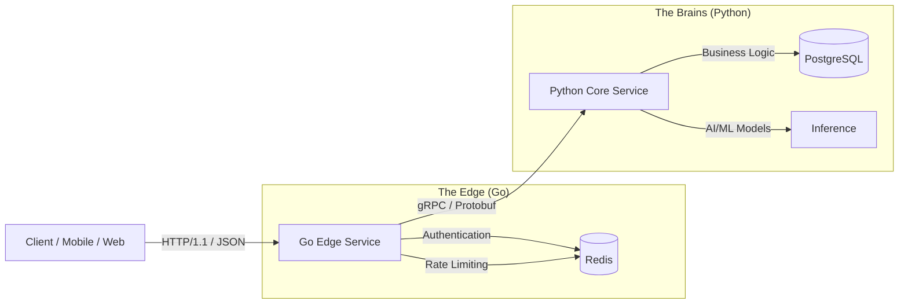

# Architectural Structure & Design Philosophy

## 1. Vision: The "Zero to Hero" Engineering System
This repository is not just a collection of code; it is a **codified engineering standard** designed to scale from a single developer to a distributed organization. It mirrors the evolution of a codebase in a high-growth environment (FAANG/MANGA style).

### The Three Pillars
1.  **Idiomatic Consistency**: Every language is written as a native expert would write it. Python uses `asyncio`, Type hints, and Pydantic. Go uses `interfaces`, channels, and idiomatic error handling. We do not write "Java in Python" or "Python in Go".
2.  **Performance & Scalability**: The system is designed for high throughput and low latency. We use asynchronous I/O (Python) for bound operations and concurrent execution (Go) for compute/network heavy lifting.
3.  **Operational Excellence**: Code is liability until it is deployed and observable. We prioritize "production-readiness" (Metrics, Tracing, Logging, CI/CD) from Day 1.

---

## 2. High-Level Architecture: The Polyglot Bridge

We employ a **Split-Stack Architecture** to leverage the specific strengths of each language:

### Why this split?
- **Go (The Edge):**
  - **Role:** API Gateway, Proxy, WebSocket aggregation, Rate Limiting.
  - **Why:** Static typing, massive concurrency (goroutines), low memory footprint, instant startup. Perfect for handling 100k+ concurrent connections.
  - **Key Libraries:** `net/http`, `grpc-go`, `uber-go/zap`.

- **Python (The Brains):**
  - **Role:** Complex Business Logic, Data Processing, AI/ML Integration.
  - **Why:** Unmatched ecosystem (Pandas, PyTorch, NumPy), expressiveness, speed of iteration.
  - **Architecture:** Clean Architecture (Onion/Hexagonal) to decouple the domain from the framework.
  - **Key Libraries:** `FastAPI` (or `gRPC`), `SQLAlchemy` (Async), `Pydantic`.

---

## 3. Directory Layout Strategy

The repository structure reflects the separation of concerns:

- **`/01_async_concepts` - `/03_language_specific_guidelines`**: **The Foundation**. Pure educational material establishing the "Basecamp" knowledge required to contribute.
- **`/clean_python`**: **The Domain Core**. A reference implementation of Clean Architecture in Python. Focus on `Domain`, `Adapters`, and `Service Layer`.
- **`/go`**: **The Systems Core**. Microservices and infrastructure components written in Go.
- **`/proto`**: **The Contract**. The immutable interface between our services. Single source of truth.
- **`/05_tooling_and_best_practices`**: **The Guardrails**. CI/CD, Linters (Ruff, GolangCI-Lint), and Security scanning (Snyk/Trivy).

## 4. Development Workflow (The "Inner Loop")
1.  **Define Contract**: Update `.proto` files.
2.  **Generate Code**: Run `make proto` to generate Go and Python stubs.
3.  **Implement Domain**: Add logic in `clean_python/src/domain`.
4.  **Implement Service**: Wire it up in `clean_python/src/service_layer`.
5.  **Expose**: Add gRPC handler in `entrypoints`.
6.  **Consume**: Update Go client to use new methods.

## 5. Future Roadmap
- **Event Sourcing**: Integrating Kafka/Redpanda for async communication.
- **Service Mesh**: Introducing Istio/Linkerd concepts (simplified).
- **Deployment**: Kubernetes manifests and Helm charts.
