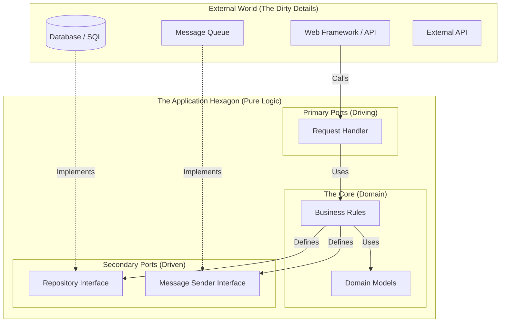

# Why Hexagonal Architecture? (Ports & Adapters)

## The Core Problem: The "Big Ball of Mud"

In traditional layered architecture (e.g., MVC), dependencies often leak. The UI depends on the Business Logic, which depends on the Database. This creates a transitive dependency: **Your Business Logic is coupled to your Database.**

If you change your database from SQL to NoSQL, you rewrite your business logic. If you want to test your business logic, you must spin up a database. This is slow, brittle, and expensive.

## The Solution: Inverting the Dependencies

Hexagonal Architecture (or Ports & Adapters) solves this by **inverting** the dependency rule. The "inside" (Business Logic) knows *nothing* about the "outside" (Web, Database, Queue).

### Visualizing the Hexagon

The "Hexagon" is just a metaphor for the boundary of your application.

### Key Components

1.  **The Core (Domain):**
    *   Contains **Pure Business Logic**.
    *   No frameworks, no SQL, no HTTP.
    *   Defines **Interfaces (Ports)** for what it needs (e.g., "I need to save a user").

2.  **Ports (The API of the Core):**
    *   **Primary (Driving):** How the outside world talks to the Core (e.g., `UserService`).
    *   **Secondary (Driven):** How the Core talks to the outside world (e.g., `UserRepository`, `EmailSender`).

3.  **Adapters (The Glue):**
    *   **Primary Adapters:** Convert HTTP requests to Domain calls (e.g., FastAPI handlers, CLI commands).
    *   **Secondary Adapters:** Implement the Secondary Ports (e.g., `SqlAlchemyUserRepository` implements `UserRepository`).

## Why Do We Do This? (The ROI)

### 1. Testability (Velocity)
*   **Traditional:** Integration tests require a live DB. Slow (seconds). Flaky.
*   **Hexagonal:** You can test the Core with **Fake Adapters** (e.g., `InMemoryUserRepository`). Fast (milliseconds). Deterministic.
*   **Result:** You can run 1000s of unit tests in seconds, enabling true TDD and confidence.

### 2. Delaying Decisions (Flexibility)
*   You can build the *entire* business logic without choosing a database.
*   Start with an in-memory dictionary. Move to SQL when the schema stabilizes. Move to Cassandra when you hit scale.
*   **The Core never changes.**

### 3. Framework Agnostic (Longevity)
*   Frameworks die. Business logic persists.
*   When you upgrade from Flask to FastAPI (or whatever comes next), you only rewrite the **Primary Adapter**. The Core Logic remains untouched.

### 4. Parallel Development (Scale)
*   One team works on the Core logic.
*   Another team works on the Postgres Adapter.
*   Another team works on the Public API.
*   They agree on the **Port (Interface)** and work independently.

## When NOT to use it?

Hexagonal Architecture introduces boilerplate (interfaces, DTOs, mappers).
*   **Avoid if:** Building a simple CRUD app, a prototype, or a script.
*   **Use if:** Building a long-lived system with complex business rules, multiple integrations, or strict testing requirements.